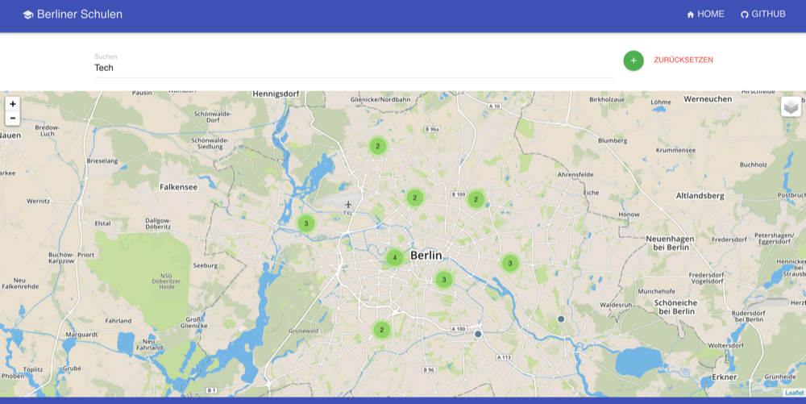

# Berliner Schulen
### Open Data Projekt des Projektverbunds Initiative 2.0
---

## Was ist das hier?

*Berliner Schulen* ist ein Open Data Projekt des [Projektverbunds Initivative 2.0](http://ini20.de). Das Projekt wurde von Studenten der TU Berlin umgesetzt und hat das Ziel die Suche nach einer passenden Schule zu erleichtern.

### Was ist Open Data?

Wenn man von *Open Data* hört wird von Daten gesprochen, die folgende idealen Eigenschaften vereinen:

- Offene Lizenzen
	- Jeder darf die Daten nutzen und weiterverarbeiten
- Offene Datenformate (z.B. CSV)
- Maschinenlesbare Rohdaten
- Diskriminierungsfrei (z.B. ohne Login, Kostenfrei)
- Proaktiv + Zeitnah

[Quelle: codefor.de - Open Data – Und was hat das mit mir zu tun?](http://codefor.de/presse/)

Julia Kloiber und Stefan Wehrmeyer haben 2013 auf der re:publica einen guten Vortrag über das Thema gehalten. Der Talk is auf [YouTube](https://www.youtube.com/watch?v=QBSNr6UXIJg) verfügbar.

## Die Daten

Die Daten aller Schulen von Berlin sind leider noch nicht komplett auf dem [Open Data Portal der Stadt Berlin](http://daten.berlin.de/) verfügbar sondern nur über dieses [Suchformular](http://www.berlin.de/sen/bildung/schulverzeichnis_und_portraets/anwendung/). Wir haben die Daten der letzten Jahre direkt angefordert und **bedanken uns an dieser Stelle auch herzlich bei der Stadt Berlin für die Hilfsbereitschaft**.

Der Datensatz ist unter `data/` abgelegt. Dort ist auch das `parse.js` script zu finden, welches die CSV Daten in ein simpleres JSON konvertiert.

## Mitwirken

Wenn du eine Idee hast wie man die App noch verbessern kann oder du hast einen Bug gefunden, dann kannst du einfach ein [Issue](https://github.com/ini20/berliner-schulen/issues/) erstellen oder uns ein Pull Request senden.
